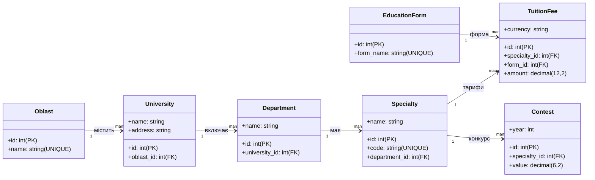

```mermaid
classDiagram
direction LR

class Oblast {
  +id: int (PK)
  +name: string (UNIQUE)
}

class University {
  +id: int (PK)
  +name: string
  +address: string
  +oblast_id: int (FK)
}

class Department {
  +id: int (PK)
  +name: string
  +university_id: int (FK)
}

class Specialty {
  +id: int (PK)
  +code: string (UNIQUE)
  +name: string
  +department_id: int (FK)
}

class EducationForm {
  +id: int (PK)
  +form_name: string (UNIQUE)
}

class TuitionFee {
  +id: int (PK)
  +specialty_id: int (FK)
  +form_id: int (FK)
  +amount: decimal(12,2)
  +currency: string
}

class Contest {
  +id: int (PK)
  +specialty_id: int (FK)
  +year: int
  +value: decimal(6,2)
}

Oblast "1" --> "many" University : містить
University "1" --> "many" Department : включає
Department "1" --> "many" Specialty : має
Specialty "1" --> "many" TuitionFee : тарифи
EducationForm "1" --> "many" TuitionFee : форма
Specialty "1" --> "many" Contest : конкурс

```
