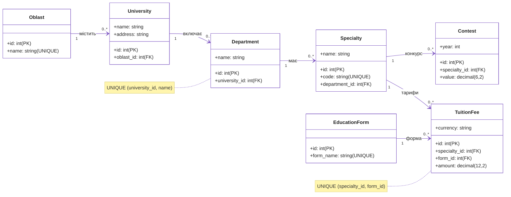

```mermaid
%%{init: { "theme": "base", "themeVariables": {
  "primaryColor": "#ffffff",
  "primaryTextColor": "#222222",
  "primaryBorderColor": "#7E57C2",
  "lineColor": "#7E57C2",
  "fontSize": "14px"
}} }%%
classDiagram
direction LR

class Oblast {
  +id: int (PK)
  +name: string (UNIQUE)
}

class University {
  +id: int (PK)
  +name: string
  +address: string
  +oblast_id: int (FK)
}

class Department {
  +id: int (PK)
  +name: string
  +university_id: int (FK)
}

class Specialty {
  +id: int (PK)
  +code: string (UNIQUE)
  +name: string
  +department_id: int (FK)
}

class EducationForm {
  +id: int (PK)
  +form_name: string (UNIQUE)
}

class TuitionFee {
  +id: int (PK)
  +specialty_id: int (FK)
  +form_id: int (FK)
  +amount: decimal(12,2)
  +currency: string
}

class Contest {
  +id: int (PK)
  +specialty_id: int (FK)
  +year: int
  +value: decimal(6,2)
}

%% зв'язки з кратностями (Mermaid не рисует crow's-foot, поэтому ставим 1 / 0..*)
Oblast "1" --> "0..*" University : містить
University "1" --> "0..*" Department : включає
Department "1" --> "0..*" Specialty : має
Specialty "1" --> "0..*" TuitionFee : тарифи
EducationForm "1" --> "0..*" TuitionFee : форма
Specialty "1" --> "0..*" Contest : конкурс

%% нотатки про складні UNIQUE
note for Department "UNIQUE (university_id, name)"
note for TuitionFee "UNIQUE (specialty_id, form_id)"

```
