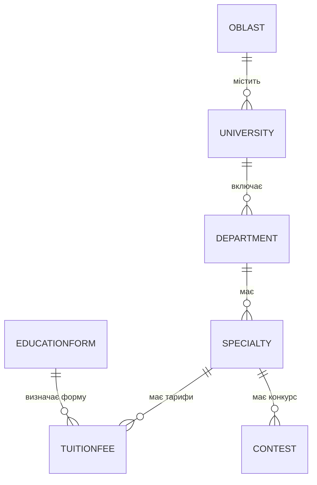

```mermaid
erDiagram
    OBLAST ||--o{ UNIVERSITY : "містить"
    UNIVERSITY ||--o{ DEPARTMENT : "включає"
    DEPARTMENT ||--o{ SPECIALTY : "має"
    SPECIALTY ||--o{ TUITIONFEE : "має тарифи"
    EDUCATIONFORM ||--o{ TUITIONFEE : "визначає форму"
    SPECIALTY ||--o{ CONTEST : "має конкурс"
```
