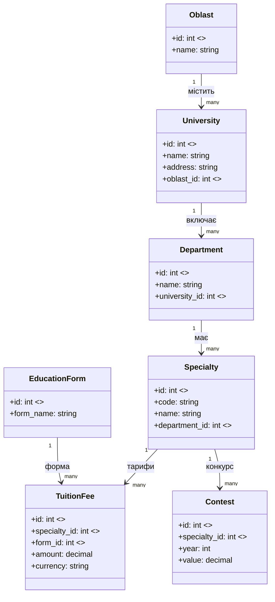

```mermaid
classDiagram
    class Oblast {
      +id: int <<PK>>
      +name: string
    }

    class University {
      +id: int <<PK>>
      +name: string
      +address: string
      +oblast_id: int <<FK>>
    }

    class Department {
      +id: int <<PK>>
      +name: string
      +university_id: int <<FK>>
    }

    class Specialty {
      +id: int <<PK>>
      +code: string
      +name: string
      +department_id: int <<FK>>
    }

    class EducationForm {
      +id: int <<PK>>
      +form_name: string
    }

    class TuitionFee {
      +id: int <<PK>>
      +specialty_id: int <<FK>>
      +form_id: int <<FK>>
      +amount: decimal
      +currency: string
    }

    class Contest {
      +id: int <<PK>>
      +specialty_id: int <<FK>>
      +year: int
      +value: decimal
    }

    Oblast "1" --> "many" University : містить
    University "1" --> "many" Department : включає
    Department "1" --> "many" Specialty : має
    Specialty "1" --> "many" TuitionFee : тарифи
    EducationForm "1" --> "many" TuitionFee : форма
    Specialty "1" --> "many" Contest : конкурс

```
